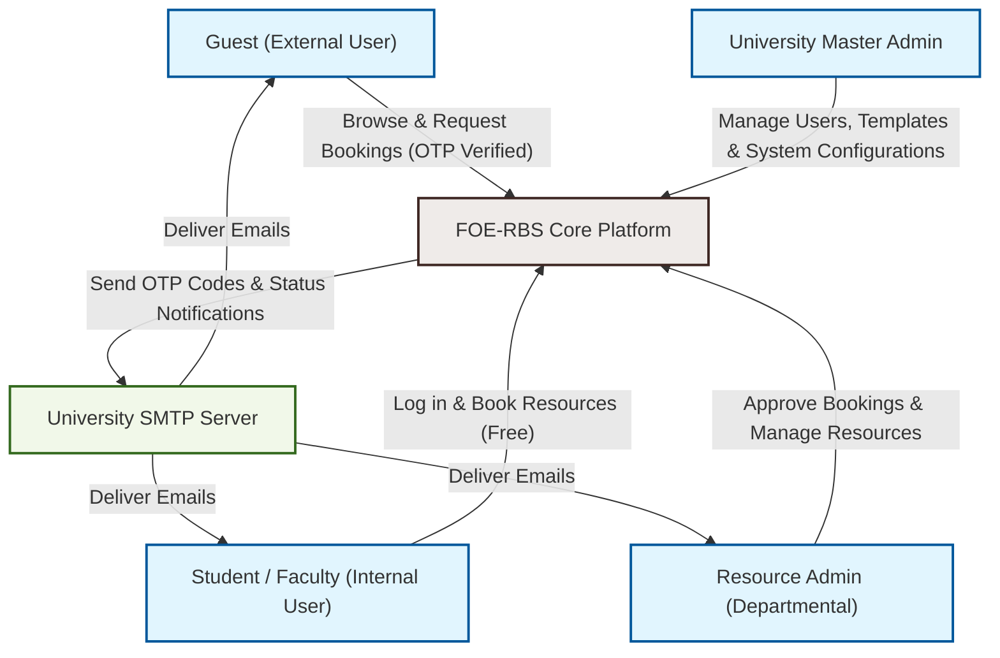
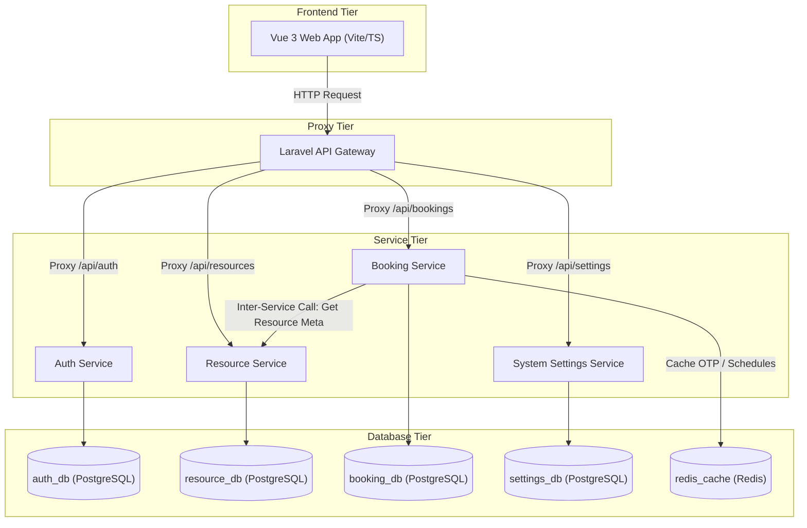
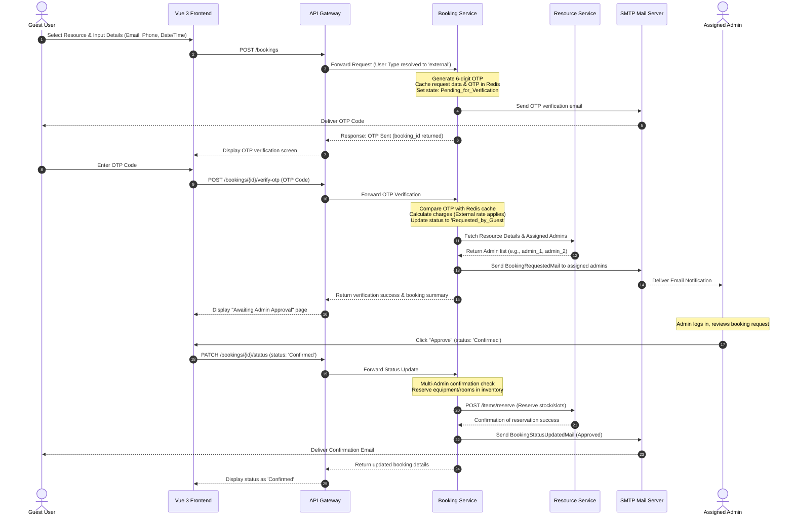
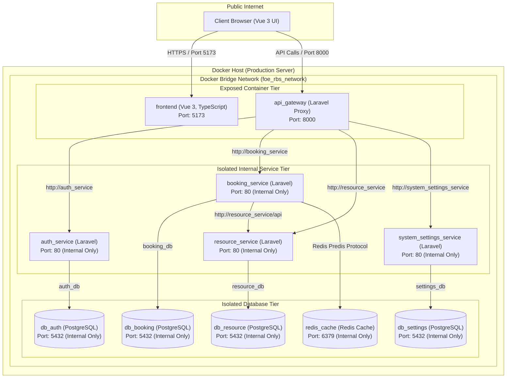

# Project Documentation: Faculty of Engineering Resource Booking System (FOE-RBS)
### University of Sri Jayewardenepura

---

## 1. Executive Summary & Project Overview

The **Faculty of Engineering Resource Booking System (FOE-RBS)** is a modern, enterprise-grade digital platform designed specifically for the University of Sri Jayewardenepura. The system manages, schedules, and tracks university assets, such as lecture halls, computer laboratories, research equipment, seminar rooms, and auxiliary items. 

By replacing legacy paper-based schedules and fragmented Google Calendars, FOE-RBS coordinates resource allocation across multiple academic departments, ensuring transparent booking procedures, automatic billing (for guest/external users), and strict approval workflows.

### Core Objectives
*   **Asset Accessibility**: Providing a centralized resource catalog for students, academic staff, and external guests.
*   **Operational Transparency**: Orchestrating a robust multi-admin approval flow where departmental admins control their own resources while maintaining global visibility for university heads.
*   **Security & Compliance**: Implementing Role-Based Access Control (RBAC) with granular permission overrides, OTP verification for external guest bookings, and secure API gateways.
*   **Data Isolation**: Adhering to the Microservices architecture pattern with isolated databases per service to guarantee resilience, compliance, and modular scalability.

---

## 2. System Architecture

The FOE-RBS system is built on a **Microservices Architecture** to ensure that components are loosely coupled, highly cohesive, and independently deployable. 

### System Context Diagram

The following diagram illustrates how the system's users and external interfaces interact with the FOE-RBS core platform.



---

## 3. Technology Stack & Languages

The system relies on a battle-tested web-application stack chosen to balance developer productivity, execution performance, and institutional maintainability.

### Frontend (User Interface)
*   **Framework**: **Vue.js 3** (using the modern Composition API) for reactive components and an engaging user experience.
*   **Language**: **TypeScript** to enforce type safety, reduce runtime errors, and streamline IDE code intelligence.
*   **State Management**: **Pinia** for centralized state tracking across booking carts, user profiles, and system settings.
*   **Router**: **Vue Router** featuring navigation guards to restrict access based on authenticated roles.
*   **Styling**: **Bootstrap 5** and **Bootstrap Icons** for a responsive dashboard that displays cleanly on mobile, tablet, and desktop monitors.
*   **Visualization & Export**: **Chart.js** (via `vue-chartjs`) for real-time resource utilization reporting, and **jsPDF** (with `jspdf-autotable`) to compile printable reports for university administrative heads.

### Backend (Microservices Core)
*   **Framework**: **Laravel PHP (v9.x)** powering the API Gateway and backend services. Laravel provides built-in HTTP client wrappers, ORM (Eloquent), validation layers, and database migration engines.
*   **Language**: **PHP (v8.2)** configured with OPcache enabled in production to maximize performance.
*   **Authentication & Tokens**: **Laravel Sanctum** providing lightweight token-based authentication for stateful API gateway requests.

### Caching & Messaging
*   **In-Memory Store**: **Redis** serving as a high-speed cache for the Booking Service. It coordinates temporary OTP sessions and compiles booking data to prevent repetitive relational queries.

### Database Layer
*   **Relational Engine**: **PostgreSQL 15** databases. PostgreSQL is selected for its robust compliance, support for structured JSON columns (critical for template configurations), and indexing capabilities.

### Infrastructure & Containerization
*   **Virtualization**: **Docker** packaging each service, configuration, and environment variable into an immutable blueprint.
*   **Orchestration**: **Docker Compose** coordinating backend services, proxy gateways, and database instances.

---

## 4. Key Design Patterns & Methodologies

The project is architected around modern web design patterns to ensure scalability, security, and clean separation of concerns.

### 1. The API Gateway Pattern
Instead of the front-end directly querying multiple backend microservices, a single unified entry point—the **API Gateway**—is positioned in front of them.
*   **Routing**: The Gateway proxies incoming requests (e.g., `/api/bookings`) to the internal service hostnames (e.g., `http://booking_service/api/bookings`).
*   **Payload Flattening**: Handles multipart form-data requests recursively, translating front-end file uploads (like resource photos and university logos) into microservice-compatible streams.
*   **Authentication Header Enrichment**: Verifies the user's bearer token via Laravel Sanctum and forwards details down-stream using custom headers (such as `X-User-Id`, `X-User-Role`, and `X-User-Email`).

### 2. Database-per-Service (Data Isolation)
To prevent databases from becoming bottlenecks or vectors of shared failure, each microservice maintains its own PostgreSQL database container (`db_auth`, `db_resource`, `db_booking`, `db_settings`).
*   Services communicate exclusively through REST APIs.
*   Direct cross-database queries are strictly forbidden. For example, when the Booking Service needs resource detail profiles, it executes an HTTP request to the Resource Service rather than running an SQL JOIN command.

### 3. Role-Based Access Control (RBAC) with Overrides
The security model is defined dynamically:
*   **Default Role Permissions**:
    *   `Master Admin`: Wildcard capabilities (`*`) to create templates, change global settings, configure departments, manage categories, and edit users.
    *   `Admin`: Access to manage resources under their department, view assigned bookings, run financial reports, and edit users.
    *   `User`: Standard university student or faculty credentials. Allowed to browse resources, manage their personal booking queue, and update their own password.
*   **Granular Permission Overrides**: Supported through the `user_permission_overrides` database table. A Master Admin can grant or revoke specific permissions (like `view_reports` or `manage_bookings`) on an individual user basis, overriding default role allowances.

### 4. Cache-Aside & Tagging Pattern
The system leverages Redis to implement the **Cache-Aside** strategy.
*   Large aggregations (like all bookings or admin dashboards) are stored in Redis under tag labels (e.g., `bookings` tag).
*   Any status change, insertion, or deletion automatically triggers a cache flush (`Cache::tags(['bookings'])->flush()`), forcing subsequent queries to pull fresh database records.

---

## 5. Component & Service Breakdown



### 1. API Gateway (`api-gateway`)
Acts as the central reverse proxy.
*   **Sanctum Guard**: Authenticates the front-end requests.
*   **Proxy Logic**: Converts public REST calls into internal docker host requests using Laravel's HTTP Client (`Http::timeout()`).

### 2. Authentication Service (`auth_service`)
Manages university identity records, credentials, and authorization details.
*   **Tokens**: Handles login validation, password resets, and session key generation.
*   **RBAC Evaluator**: Houses the permission override evaluation engine, feeding effective user permissions back to the Gateway.

### 3. Resource & Inventory Service (`resource_service`)
Manages the university's resource catalog.
*   **Dynamic Attribute Templates**: Implements a template engine where admins can define custom attributes for resources (e.g., seating layouts, projector configurations) dynamically. These definitions are stored as JSON attributes.
*   **Availability Calendars**: Records week-day parameters and specific scheduling slots for classrooms and labs.
*   **Auxiliary Booking Items**: Keeps track of supplementary hardware (like laptops and PA systems) including stock metrics.

### 4. Booking & Scheduling Service (`booking_service`)
Houses the main scheduling constraints, OTP operations, and approval steps.
*   **Pricing Engine**: Validates user type. Bookings for internal personnel (students/faculty) calculate to a total rate of `0.00 LKR` (free). Bookings for external guests apply departmental commercial rates.
*   **Inventory Allocator**: Calls the Resource Service to secure items when bookings are verified or confirmed, ensuring assets aren't double-booked.

### 5. System Settings Service (`system_settings_service`)
Provides configurations for branding, logos, departmental contacts, and terms of service.

---

## 6. Detailed System Workflows

### 1. Guest Booking Lifecycle & OTP Verification Flow

The system implements a secure passwordless booking verification mechanism for guests using email-based One-Time Passwords (OTPs) and distributed caching.



### 2. Multi-Admin Confirmation Flow
To coordinate bookings that cross department lines or involve shared high-value resources, a **Multi-Admin approval consensus check** is built into the status update pipeline.

```
       [Admin Approves Booking]
                  │
                  ▼
   [Is User Role = Master Admin?] ──(Yes)──► [Directly Confirm & Reserve]
                  │ (No)
                  ▼
     [Get All Assigned Admins 
     from Resource Service]
                  │
                  ▼
   [Is Current Admin in the List?] ──(No)──► [Throw 403 Forbidden]
                  │ (Yes)
                  ▼
   [Record Admin ID in database JSON]
                  │
                  ▼
   [Do recorded IDs match all 
   assigned admins for the resources?] ──(No)──► [Save State: Keep Status Pending]
                  │ (Yes)
                  ▼
      [Transition status to 'Confirmed']
      [Reserve Inventory Assets]
      [Trigger Booking Confirmation Email]
```

---

## 7. Database Schemas & Table Relationships

The database layer consists of four distinct schemas matching the PostgreSQL instances.

### 1. Authorization Database (`auth_db`)

```
   ┌──────────────┐          ┌─────────────┐
   │    users     │1        *│  role_user  │
   ├──────────────┤──────────├─────────────┤
   │ id (PK)      │          │ user_id (FK)│
   │ name         │          │ role_id (FK)│
   │ email        │          └─────────────┘
   │ password     │                 *│
   │ status       │                  │
   │ department   │                  │1
   └──────────────┘          ┌─────────────┐
          │1                 │    roles    │
          │                  ├─────────────┤
          │*                 │ id (PK)     │
   ┌──────────────┐          │ name        │
   │ permission_  │          └─────────────┘
   │ overrides    │
   ├──────────────┤
   │ id (PK)      │
   │ user_id (FK) │
   │ permission_  │
   │  slug        │
   │ is_allowed   │
   └──────────────┘
```

*   **`users`**: Academic profiles, encrypted passwords, and departments.
*   **`roles`**: Key system definitions (`Master Admin`, `Admin`, `User`).
*   **`user_permission_overrides`**: Granular true/false flags overriding role-default access policies.

### 2. Resource Database (`resource_db`)

*   **`categories`**: Generic tags such as `Laboratory`, `Auditorium`, `Projector`.
*   **`resource_templates`**: Link definitions for custom blueprints.
*   **`template_fields`**: Configurable input fields (text, number, boolean) associated with a blueprint.
*   **`resources`**: Main resource table. Contains the `template_data` **JSON column** holding Key-Value pairs matching the schema defined by the template's fields.
*   **`resource_availabilities`**: Tracks which days of the week (1–7) a resource can be reserved.
*   **`resource_availability_slots`**: Custom time ranges available on specific days.
*   **`booking_items`**: Supplementary hardware assets that can be reserved alongside a location (e.g., microphones, projection pointers).
*   **`item_stock_logs`**: Inventory logs checking incoming reserves and outgoing releases to prevent physical stock depletion.

### 3. Booking Database (`booking_db`)

*   **`bookings`**: Stores general metadata (reference code, user ID/email, verified flag, verification OTP, status code, total billing, and the `confirmed_by_admins` **JSON list** of approvals).
*   **`booking_details`**: Line item table. Stores specific details of the assets booked (`item_type` is either `resource` or `booking_item`), quantities, durations, and calculated subtotals.

### 4. Settings Database (`settings_db`)

*   **`system_settings`**: Key-value rows for university logo paths, support lines, terms, and billing instructions.

---

## 8. Containerized Deployment & Infrastructure

The application relies on Docker Compose to set up isolated network zones and secure local resource dependencies.

### Containerized Deployment Diagram

This diagram displays the network boundary limits. Internal containers (`auth_service`, `db_auth`, etc.) cannot be accessed from outside the Docker virtual network, protecting the database layer from external network scanning.



### Production Security Best Practices

> [!WARNING]
> In production, you must ensure databases and downstream microservices do not expose raw container ports directly to the public host. Follow the configuration recommendations below to secure the infrastructure.

1.  **Expose Only the Front Door**:
    *   **Frontend**: Port `5173` (or port `80`/`443` bound using an Nginx reverse proxy on the host).
    *   **API Gateway**: Port `8000` (or proxy-bound to `/api` on the main SSL certificate domain).
    *   **Microservices**: Ensure that the `ports:` settings for internal microservices (`auth_service`, `resource_service`, `booking_service`, `system_settings_service`) in `docker-compose.yml` are commented out or removed. They do not need host mapping because the API Gateway communicates with them using Docker's internal DNS system.
2.  **Isolate Databases**:
    *   Ensure that the `ports` arrays for `db_auth`, `db_resource`, `db_booking`, and `db_settings` are completely commented out. Isolating these ports prevents external actors from scanning, brute-forcing, or accessing data records directly.
3.  **Secure Inter-Service DNS Resolution**:
    *   Microservices and databases must resolve endpoints through the internal Docker Bridge network (`foe_rbs_network`).
    *   For example, the API Gateway accesses the Authentication service at `http://auth_service/api/` instead of using a public IP. Docker Compose registers the container name as an alias within the isolated bridge network's DNS server.

---

## 9. IT Administrator Environment Variable Checklist

Before deploying the container array to the University of Sri Jayewardenepura production servers, the system administrators must configure the environment variables across the services.

### Global Configuration & Frontend Variables
Within the `frontend/` environment files:
*   `VITE_API_BASE_URL`: Must point to the public domain or IP address of the API Gateway (e.g., `https://rbs.sjp.ac.lk/api` or `http://10.10.20.5:8000/api`).

### API Gateway Environment Variables
*   `APP_ENV`: Set to `production`.
*   `APP_DEBUG`: Set to `false` to disable detailed error stack outputs in public API responses.
*   `SANCTUM_STATEFUL_DOMAINS`: The domain name from which the frontend requests originate (e.g., `rbs.sjp.ac.lk`).
*   `CORS_ALLOWED_ORIGINS`: Limits CORS requests to the university host domain (e.g., `https://rbs.sjp.ac.lk`).

### Microservice-Specific Environment Configs

Use this checklist to verify connections across the backend services:

| Target Container | Variable Key | Production Recommended Value | Purpose |
| :--- | :--- | :--- | :--- |
| **api_gateway** | `APP_KEY` | `base64:UNI_SECURE_RANDOM_KEY...` | Encrypts session cookies and tokens |
| **api_gateway** | `DB_HOST` | `db_auth` | Gateway queries user roles from auth db |
| **auth_service** | `DB_HOST` | `db_auth` | Database host container |
| **auth_service** | `DB_PASSWORD` | *Strong unique password* | Auth database credential |
| **booking_service** | `DB_HOST` | `db_booking` | Database host container |
| **booking_service** | `RESOURCE_SERVICE_URL`| `http://resource_service/api` | Internal container URL mapping |
| **booking_service** | `REDIS_HOST` | `redis_cache` | Internal cache target container |
| **booking_service** | `MAIL_HOST` | `smtp.sjp.ac.lk` | University mail server host |
| **booking_service** | `MAIL_PORT` | `587` / `465` | SMTP port |
| **booking_service** | `MAIL_USERNAME` | `rbs-notifications@sjp.ac.lk` | Sender account |
| **booking_service** | `MAIL_PASSWORD` | *Secure SMTP Key* | Email account authorization key |
| **resource_service** | `DB_HOST` | `db_resource` | Database host container |
| **system_settings** | `DB_HOST` | `db_settings` | Database host container |

---

## 10. Quickstart Local Deployment

To run a development version locally to test configurations:

1.  **Clone & Configure**:
    Navigate to the project root directory and copy environmental templates:
    ```bash
    cp api-gateway/.env.example api-gateway/.env
    cp services/auth_service/.env.example services/auth_service/.env
    cp services/booking_service/.env.example services/booking_service/.env
    cp services/resource_service/.env.example services/resource_service/.env
    cp services/system_settings_service/.env.example services/system_settings_service/.env
    ```

2.  **Generate Encryption Keys**:
    Generate the Laravel application key for the API Gateway and Auth Service:
    ```bash
    docker-compose run --rm api_gateway php artisan key:generate
    docker-compose run --rm auth_service php artisan key:generate
    ```

3.  **Launch Containers**:
    Build and start the network tier:
    ```bash
    docker-compose up -d --build
    ```

4.  **Run Migrations**:
    Apply database schema layouts to the isolated tables:
    ```bash
    docker-compose exec auth_service php artisan migrate --seed
    docker-compose exec resource_service php artisan migrate --seed
    docker-compose exec booking_service php artisan migrate --seed
    docker-compose exec system_settings_service php artisan migrate --seed
    ```

The system will be accessible locally via:
*   **Web Interface**: `http://localhost:5173`
*   **API Gateway**: `http://localhost:8000/api`
